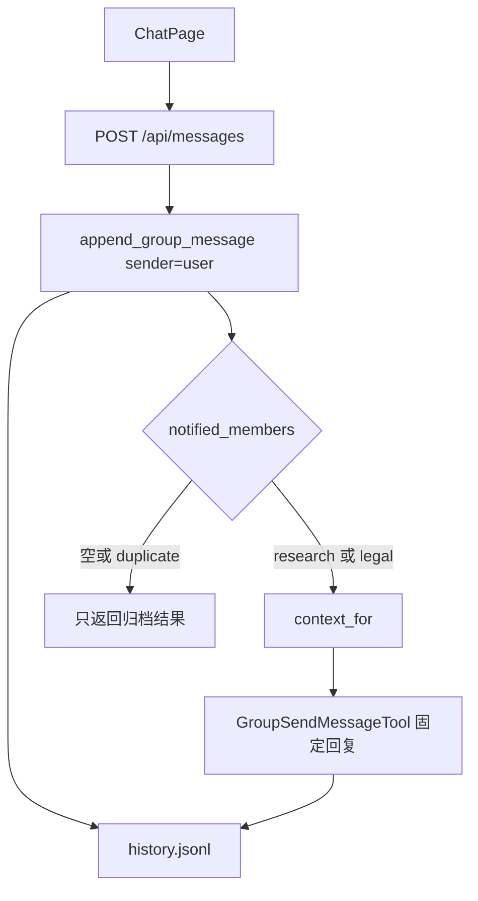

# 专家协作空间：用 SwarmChat 群聊做一间可演示的离线聊天室

不改现有 `swarmflow_a2ui`、`wsdw_multi_workflow`。新建 `learn_note/example/swarmchat_room`，不接真实模型，不拉起 `TeamAgent`。页面是一间公开聊天室：人说话全部归档；只有勾选的专家会被叫醒，并用固定文案公开回复。

公开归档、成员校验和 `history.jsonl` 投影走现成的 `openjiuwen.agent_teams.group_chat.handler.post_message`，经 `TeamBackend.append_group_message` 调用。被叫醒的专家用 `GroupSendMessageTool` 发言。摘录用同模块的 `context_for`。

## 功能介绍

这间房间演示 SwarmChat 专家协作空间里已经落地的四件事：

- 公开消息按团队 `room`、会话 `discussion-1` 写入数据库广播，并投影到 workspace 的 `history.jsonl`。
- `mentions` 是显式成员名列表。为空时只归档，`notified_members` 为空，专家不发言。
- 点名存在的专家时，该专家拿到从自己的广播 `read_at` 到本次触发消息的最近 5 条摘录，以及 `history.jsonl` 的绝对路径，然后公开回复。回复走同一条归档链路，`mentions` 留空，避免专家互相叫醒。
- 相同 `client_message_id` 重发同一正文返回 `duplicate=true`，不再次回复。未知成员名让整次请求失败，历史不增加。

本 demo 不跑 `GroupMessageHandler`，因此不推进 `read_at`。两位专家第一次被 @ 时水位都是 0，摘录窗口是 `(0, 触发时间]` 内最新 5 条，并带上本次触发消息。法务因此能在摘录里看到研究专家已经发到群里的回复。研究不在法务那条消息的 `notified_members` 里，所以不会再次开口。

宿主输入的作者固定为 `user`。专家发言的作者是当时的 `backend.member_name`。工具不接受调用方指定的 `sender` 或 `team_name`。

## 使用场景

页面要让人看懂这三件事，不必接模型：

- 几个人先把约束说完。输入「预算 10 万，两周上线。」且两个专家都不勾选。消息进历史，旁边没有摘录，也没有专家气泡。
- 需要研究意见时勾选研究。研究专家看到刚才的约束，并当众回复。房间里的人都能看见这句回复。
- 随后只勾选法务。法务的摘录里含有研究的公开回复；研究保持沉默。

手工输入和「播放脚本」走同一个 `POST /api/messages`。

## 不在本 demo

- jiuwenswarm 大群代理人、`run_team` / `submit_team_result`。
- Claude Code、Codex 等第三方成员。
- 附件上传。`attachments` 固定传空列表。
- 定向邮箱 `OperatorMessage`、任务看板、Leader 模型输出。
- 真实 `read_at` 推进。同一专家被第二次 @ 时，摘录仍从 0 取最近 5 条。

## 架构



```text
learn_note/example/swarmchat_room/
  backend/__init__.py
  backend/room.py          # 建房、归档、摘录、固定回复
  backend/main.py          # FastAPI
  frontend/package.json
  frontend/index.html
  frontend/vite.config.ts
  frontend/tsconfig.json
  frontend/src/main.tsx
  frontend/src/App.tsx
  frontend/src/styles.css
```

进程内只有一份房间。数据库用 `TeamDatabase(DatabaseConfig(connection_string=":memory:"))`。事件总线用 `InProcessMessager()`，不订阅消费者；`publish_broadcast` 失败只记日志，不回滚已写入的广播。`TeamBackend("room", "leader", True, db, messager)` 自带 `message_manager`。

`group_chat_spec` 设为：

```python
TeamAgentSpec(
    agents={"leader": DeepAgentSpec()},
    team_name="room",
    leader=LeaderSpec(member_name="leader"),
)
```

摘录文案因此走中文（`context_for` 在 spec 没有 `language` 时用 `cn`）。

## 房间与名册

启动时 `await db.initialize()`，然后：

1. `db.team.create_team("room", "专家协作空间", "leader")`
2. `db.member.create_member("leader", "room", "主持人", "{}", "ready", role="leader")`
3. `db.member.create_member("research", "room", "研究", "{}", "ready", role="teammate")`
4. `db.member.create_member("legal", "room", "法务", "{}", "ready", role="teammate")`
5. `backend.group_chat_spec = spec`，`backend.bind_group_session("discussion-1")`

固定回复只准备这两句：

| 成员 | 回复正文 |
| --- | --- |
| `research` | 两周内可以交付只读查询和人工复核。自动下单超出本期范围。 |
| `legal` | 预算 10 万按固定总价签约。两周上线要把验收范围写进合同。 |

`leader` 可以被点名并进入 `notified_members`，本 demo 不代他发言。未知名字在 `post_message` 里抛 `ValueError`，整次请求不落库。

## 演示脚本

「播放脚本」按顺序调用五次，`client_message_id` 固定：

1. `script-1`，正文「预算 10 万，两周上线。」，`mentions=[]`。`notified_members` 为空，没有专家回复。
2. `script-2`，正文「请评估技术可行性」，`mentions=["research"]`。研究专家回复，`client_message_id` 为 `reply-script-2-research`。
3. `script-3`，正文「请看法务风险」，`mentions=["legal"]`。法务摘录里能看到第 2 步的研究回复。法务回复，`client_message_id` 为 `reply-script-3-legal`。`notified_members` 只有 `legal`。
4. `script-4`，正文「请不存在的人看一下」，`mentions=["ghost"]`。接口失败，`history.jsonl` 行数与第 3 步之后相同。
5. 再次发送与第 2 步完全相同的正文、mentions 和 `script-2`。`duplicate=true`，研究专家不出现第二条回复。

专家回复的 `mentions` 始终为 `[]`。一次请求里勾选多人时，按 `notified_members` 的顺序逐个摘录、逐个回复。

## 实现步骤

### 1. `backend/room.py`

`post_user(body, mentions, client_message_id)` 整段包在 `set_session_id("discussion-1")` 里，结束时 `reset_session_id`。`post_message` 内部还会再 set/reset 一次，外层令牌会把会话恢复回来，这样随后的 `get_message` 和 `context_for` 仍打在 `discussion-1` 的动态表上。

1. `result = await backend.append_group_message("user", body, client_message_id=..., mentions=mentions, attachments=())`。
2. `result.duplicate` 为真时直接返回，不调用工具。
3. 否则对 `result.notified_members` 里的 `research` / `legal`：
   - `trigger = await backend.db.message.get_message(result.message.message_id)`。这是数据库行。不要把 `ConversationMessage` 传给 `context_for`，它要读 `meta`。
   - `excerpt = await context_for(backend, member_name, trigger)`。此时该专家的回复尚未写入，摘录停在用户这条触发消息。
   - 把 `backend.member_name` 临时改成该成员，`GroupSendMessageTool(backend, make_translator("cn")).invoke({"content": 固定回复, "client_message_id": f"reply-{client_message_id}-{member_name}"})`。成功后把 `member_name` 改回 `leader`。工具返回失败则把错误抛出。
4. 返回归档结果、每位专家的摘录原文、以及各条回复。

`get_history()` 读 `GroupConversationLog` 的 `history_path`。文件不存在时返回空列表。存在时按行 `json.loads`。路径来自 `(await backend.group_conversation()).history_path`。

代码注释用中文。

### 2. `backend/main.py`

进程启动时建一次房间，之后所有请求共用。

| 方法 | 路径 | 行为 |
| --- | --- | --- |
| GET | `/api/health` | `{"status":"ok"}` |
| GET | `/api/roster` | `research`、`legal` 的 `member_name` 与 `display_name`。页面用它画勾选框 |
| GET | `/api/history` | `{context_path, messages}`。`messages` 是 `history.jsonl` 的解析结果 |
| POST | `/api/messages` | 体为 `body`、`mentions`、`client_message_id`。成功返回 `ok`、`duplicate`、`notified_members`、`context_path`、`message`、`excerpts`、`replies`。`ValueError` 返回 HTTP 400，体为 `{"ok": false, "reason": "invalid_group_chat"}` |

`client_message_id` 由调用方传入。播放脚本用上面的固定 ID；手工发送由前端生成新的 ID。

监听 `127.0.0.1:8002`。

### 3. 前端

精简 React，无 A2UI。端口 `5175`，把 `/api` 代理到 `8002`。进入页面先拉 roster 和 history。

- 消息列表：每条显示 `sender_name` 和正文。`user` 在页面上显示为「用户」。
- 输入框，研究 / 法务两个勾选，发送按钮。
- 「播放脚本」按钮，按上一节五步顺序请求，把每步结果画出来。第 4 步的 400 显示为一条错误，不往列表里加气泡。第 5 步在研究那条上标注重复发送，不增加第二条研究回复。
- 某次响应的 `excerpts` 非空时，贴在对应的用户消息旁边，展示 `notified_members` 和摘录原文。
- 页底显示 `context_path`。

## 运行

仓库根目录：

```bash
uv run uvicorn --app-dir learn_note/example/swarmchat_room backend.main:app --host 127.0.0.1 --port 8002
```

另开终端进入 `learn_note/example/swarmchat_room/frontend`，执行 `npm install && npm run dev`，打开 http://127.0.0.1:5175 。

## 验收

点「播放脚本」后应看到：

1. 用户「预算 10 万，两周上线。」没有专家回复。
2. 用户「请评估技术可行性」，旁边摘录点名 `research`，随后出现研究的固定回复。
3. 用户「请看法务风险」，摘录点名 `legal`，摘录正文里含有研究那句「只读查询和人工复核」，随后出现法务的固定回复。研究没有第二条回复。
4. 一条「未知成员」错误。历史条数仍是：三条用户消息加两条专家回复。
5. 重复 `script-2` 后研究回复仍只有一条。页底路径以 `history.jsonl` 结尾。
