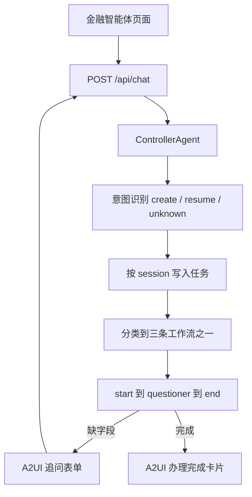

# 多工作流金融助手：一个 Agent 挂三条业务流，中途追问、断点续跑

本文记录现有 `learn_note/example/wsdw_multi_workflow`。一个 `ControllerAgent` 挂转账、理财、余额查询三条工作流。意图识别决定新建还是恢复任务；工作流缺字段时停在提问节点，下一轮用同一 `conversation_id` 续跑。页面用 A2UI v0.9 渲染欢迎入口、追问表单和办理结果。需要模型 API。

## 功能介绍

- 进程启动时装配一次金融智能体，注册三条工作流，之后所有请求共用。
- 用户每句话先做任务意图：`create_task`、`resume_task` 或 `unknown_task`。置信度低于 `0.3` 时改成 `unknown_task`。只采用模型返回的第一个工具调用。
- 新建任务的 `task_type` 固定为 `workflow`。执行器再用一次分类，把这句话分到三条工作流之一，把选中的 `workflow_id` 写入 `task.extensions`。
- 工作流是 `start -> questioner -> end`。提问器抽一个必填字段。抽不到就中断，任务变为 `INPUT_REQUIRED`，页面出现补充信息表单。
- 恢复只接受状态为 `INPUT_REQUIRED` 的任务。用户答复写回 `InteractiveInput`，从提问节点继续。状态不匹配时抛出错误，不改写任务状态。
- 同一 `conversation_id` 串行处理。任务列表按该 session 过滤，已完成任务不放进意图识别提示词。

## 使用场景

页面打开后先有一张欢迎卡，三个入口分别发送「我要转账」「我要理财」「查询余额」。也可以在输入框里直接说。

- 说「我要转账」且没给金额。助手追问金额。用户在表单里提交「500」，同一会话续跑，完成后卡片正文含「转账服务完成」。
- 说「我要理财」后追问产品名称；说「查询余额」后追问账户号码。三条流互相独立，靠 `workflow_id` 区分。
- 点「新会话」后换一个 8 位 `conversation_id`。旧会话里等人填写的任务不会出现在新会话的任务列表里。

CLI 与 Web 走同一个智能体。CLI 在终端里读入文本并打印回复；Web 把同一条流式输出编成 A2UI。

## 不在本 demo

- 文件和 JSON 输入。意图识别只接受恰好一条文本。
- 暂停、取消任务。`can_pause` / `can_cancel` 均为否。
- 闲聊专用执行器。`general` 执行器已注册，但本 demo 创建的任务类型都是 `workflow`。
- 多工作流并行。同一会话同一时刻只跑一条流。
- 真实账户、扣款或产品库。结束节点只回填抽到的字段。

## 架构



```text
learn_note/example/wsdw_multi_workflow/
  api/__main__.py                 # CLI
  api/server.py                   # FastAPI，SSE
  api/config.py                   # 模型环境变量
  api/agent_factory.py            # 装配 Agent 与三条工作流
  api/a2ui_messages.py            # Controller 输出转 A2UI
  api/handlers/event_handler.py   # 意图识别与任务创建 / 恢复
  api/executors/workflow_executor.py
  api/workflows/financial.py
  web/                            # React + A2UI v0.9
```

模型配置来自环境变量，读取顺序是：已导出的变量，然后本目录 `.env`，最后示例根目录 `.env`。

| 变量 | 默认 |
| --- | --- |
| `WSDW_API_BASE` | `https://api.deepseek.com` |
| `WSDW_API_KEY` | `API_KEY` |
| `WSDW_MODEL_NAME` | `MODEL_NAME` |
| `WSDW_MODEL_PROVIDER` | `OpenAI` |
| `WSDW_MODEL_ID` | `MODEL_ID` |

同时 `setdefault`：`LLM_SSL_VERIFY=false`，`IS_SENSITIVE=false`。模型请求 `verify_ssl=False`，超时 120 秒。

## 三条工作流

三条流结构相同，只换标识和要抽的字段。结束模板是 `{名称}完成: {{字段}}`。

| workflow_id | 名称 | 说明 | 必填字段 |
| --- | --- | --- | --- |
| `transfer_flow_multi` | 转账服务 | 处理用户转账请求，支持转账到指定账户 | `amount`：转账金额（数字） |
| `invest_flow_multi` | 理财服务 | 提供理财产品推荐和购买服务 | `product`：理财产品名称 |
| `balance_flow` | 余额查询 | 查询用户账户余额信息 | `account`：账户号码 |

分类提示词把「意图不明」标成分类 0，再按 `ability_manager` 的顺序把三条流标成分类 1、2、3。模型只返回 `{"result": int}`。`result >= 1` 时选中对应 `WorkflowCard`，写入 `task.extensions["workflow_id"]`。

## 任务状态

`ControllerConfig`：`enable_task_persistence=True`，`intent_confidence_threshold=0.3`，`event_timeout` 与 `task_timeout` 均为 `120000`。Agent id 为 `financial_agent`。

新建：

1. 生成 `task_id`，状态 `SUBMITTED`，`extensions.workflow_id` 先为空字符串。
2. 执行器发现没有 `workflow_id`，做分类，再 `Runner.run_workflow`。
3. 结果是中断列表时，把组件 id 和提问文案写入 `input_required_fields`，状态改为 `INPUT_REQUIRED`，输出 `TASK_INTERACTION`。
4. 结果不是列表时，输出 `TASK_COMPLETION`。

恢复：

1. 意图给出已有 `task_id`，且该任务状态必须是 `INPUT_REQUIRED`。否则抛出 `Cannot resume task ... expected INPUT_REQUIRED`。
2. 把本轮输入追加到 `task.inputs`，状态改回 `SUBMITTED`。
3. 用 `input_required_fields["id"]` 和最后一条用户文本构造 `InteractiveInput`，清掉 `input_required_fields`，再跑同一条工作流。
4. 已有 `workflow_id` 但 `input_required_fields` 为空时视为非法状态，抛出 `Invalid task state`。

意图提示词只列出当前 session 中未完成的任务，带上 `task_id`、描述、已有输出和状态。

## HTTP 与 A2UI

监听 `127.0.0.1:8765`。CORS 允许任意来源。

| 方法 | 路径 | 行为 |
| --- | --- | --- |
| GET | `/api/health` | `{"status":"ok"}` |
| POST | `/api/chat` | 体为 `query`、可选 `conversation_id`。缺省会话 id 取 uuid 前 8 位。响应为 `text/event-stream` |

SSE 的 `data` 是 JSON：

- `{"kind":"data","messages":[...]}`：一条或多条 A2UI v0.9 消息。
- `{"kind":"done","conversation_id":"..."}`：本轮结束。
- `{"kind":"error","text":"..."}`：本轮异常。流不因此中断成 HTTP 错误。

`TASK_PROCESSING` 和 `ALL_TASKS_PROCESSED` 不产生消息。其余事件取出文本后建一张新 Surface，catalog 为 basic catalog：

| 事件 | 卡片 |
| --- | --- |
| `TASK_INTERACTION` | 标题「需要补充信息」，正文为提问，一个短文本框，按钮「提交」，动作名 `submit_answer`，上下文带 `answer` |
| `TASK_COMPLETION` | 标题「办理完成」 |
| `TASK_FAILED` | 标题「办理失败」 |
| 其他有文本的事件 | 标题「助手回复」 |

文本若是带 `response` 字段的字面量字典，页面只显示 `response`。

## 前端

端口 `5173`，把 `/api` 代理到 `8765`。标题为「金融智能体」。

- 进入页面用本地欢迎 Surface 画出三个入口，不请求后端。
- 时间线按出现顺序排列用户气泡和 Surface。表单提交与输入框发送都调用 `POST /api/chat`，并带上当前 `conversation_id`。
- 请求进行中忽略新的发送。
- 「新会话」更换 `conversation_id` 并清空错误，欢迎卡随新的 processor 重新挂上。

## 运行

```bash
cd learn_note/example
source .venv/bin/activate
cd wsdw_multi_workflow
python -m api.server
```

另开终端：

```bash
cd learn_note/example
npm run dev:wsdw
```

浏览器打开 http://127.0.0.1:5173 。CLI 为 `python -m api`，输入 `quit`、`exit` 或「退出」结束。空输入不计入轮次。

## 验收

在已配置 `WSDW_API_KEY` 的前提下：

1. 打开页面能看到转账、理财、余额查询三张入口，以及当前会话 id。
2. 点「开始转账」后出现追问表单，而不是办理完成卡。提交一个金额后，出现「办理完成」，正文含「转账服务完成」。
3. 不点「新会话」，接着说「我要理财」。追问的是理财产品，不是上一笔转账的金额。
4. 点「新会话」后会话 id 变化。再提转账时，不会把上一会话里未完成的任务拿来恢复。
5. `GET /api/health` 返回 `{"status":"ok"}`。
