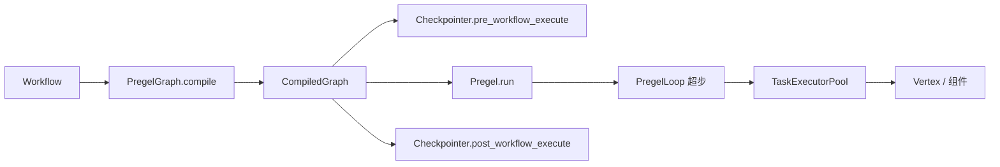

# 断点续传与 Pregel 图模型

对应 demo：`learn_note/example/pregel_checkpoint`。  
知乎文：`pregel_checkpoint/doc/断点续传不必先啃Pregel-用三课看并行汇合人机续跑与幂等.md`。

用工作流顶层 API 做三课 CLI（无模型）：并行汇合、人机续跑、异常重入与幂等。下文后半是源码探究，排障或改恢复语义时再读。

## 本 demo

### 功能介绍

- Shelve 持久化 Checkpointer，文件在 `pregel_checkpoint/workspace/`。
- **课 1**：`start -> left & right -> merge(wait_for_all) -> end`，看并行与汇合。
- **课 2**：`session.interact` → `INPUT_REQUIRED`；同 `session_id` + `InteractiveInput` 续跑；中断时打印 `GraphState`（含 `pending_nodes`）。
- **课 3**：charge 先写外部账本再抛错；恢复重入。无守卫 count=2，有守卫 count=1 且 `skipped`。顺便说明：同超步失败时节点内 session 状态可能回滚，外部副作用不会。
- **课 4**：只激活 left 却 `wait_for_all` 等 left AND right → merge 不跑、`COMPLETED` 且 `result=None`；`BranchRouter` 互斥目标收成 OR 组后可正常汇合。

### 目录

```text
pregel_checkpoint/
  backend/setup.py          # Checkpointer 初始化、GraphState 摘要
  backend/components.py     # 自定义节点
  backend/workflows.py      # 三张静态图
  backend/lessons.py        # 三课脚本
  backend/main.py           # CLI
  workspace/                # shelve 检查点与扣款账本
  doc/                      # 知乎文标题文档
  README.md
```

### 源码探究阅读顺序

先跑通三课，再按需看：「Pregel 一圈在干什么」→「状态存什么」→「中断恢复与业务幂等」。

## 1. 为什么要看 Pregel

会话式 Agent 把连续性寄在对话上下文里；检查点式工作流把状态外置到存储，中断后从快照回退，重跑代价接近「当前超步」而不是全量。

openJiuwen 的工作流底层是 Pregel 风格引擎（`Workflow` 持有 `PregelGraph`）。高层 API（组件、条件边、`wait_for_all`）最终都编译成：节点 + Channel + Router + 超步循环。

是否必须懂 Pregel（对照顶层 API）：

| 场景 | 要不要下钻 | 说明 |
| --- | --- | --- |
| 换检查点后端、开断点续跑 | 否 | `CheckpointerConfig` / `BaseKVStore`；提问器 + `InteractiveInput` |
| 副作用幂等 | 否（只需知结论） | 产品语义是「恢复会再跑该节点」；用业务状态做守卫即可，不必懂 channel / 超步 |
| 编排并行 / 汇合 / 条件分支 | 通常否 | `多出边`、`wait_for_all`、`BranchRouter` / `add_conditional_connection` 文档够用 |
| 日常人机交互 | 否 | 提问器 + `InteractiveInput` / Agent `result_type=interrupt` |
| 调试续传诡异行为（并行分支「消失」、汇合永远不触发、循环计数错乱） | 要 | 往往涉及 barrier / pending / 超步恢复，顶层 API 解释不了 |
| 改恢复语义、自研完整 Checkpointer（读写 `GraphState`） | 要 | 需理解 `channel_values`、`pending_buffer`、`pending_node`、`node_version` |
| 自写组件手动抛中断，或排障「异常被当成中断」 | 要 | 才需区分 `GraphInterrupt` 与普通异常的落盘路径 |

线性、无中断、跑完即丢的工作流，通常不必下钻。

## 2. 源码地图

```text
openjiuwen/core/graph/
  graph.py                 # PregelGraph 构图 / compile → CompiledGraph
  vertex.py                # 业务节点包装，向上抛 GraphInterrupt
  graph_state.py           # TypedDict：source_node_id 列表（激活来源）
  pregel/
    engine.py              # Pregel / PregelLoop：超步主循环
    channels.py            # ChannelManager、TriggerChannel、BarrierChannel
    builder.py             # PregelBuilder：边 → Router + Channel
    router.py              # Static / Conditional / Barrier Router
    task.py                # TaskExecutorPool / NodeTask
    base.py                # Message、Interrupt、GraphInterrupt、PregelNode
    constants.py           # START/END、TASK_STATUS_INTERRUPT、NS 等
  store/
    base.py                # GraphState、PendingNode、Store 抽象
    inmemory.py            # 内存图状态

openjiuwen/core/session/checkpointer/
  base.py                  # 命名空间常量、Checkpointer 抽象
  inmemory.py / persistence.py
openjiuwen/extensions/checkpointer/redis/
```

调用链（主工作流）：



## 3. Pregel / BSP：通用模型

Google Pregel 基于 Bulk Synchronous Parallel（BSP）：

1. 计算按超步推进。
2. 同一超步内，被激活的顶点并行执行同一套 compute。
3. 本超步发出的消息，在屏障之后才投递给下一超步。
4. 容错检查点通常落在超步边界；失败后从最近检查点重算。

论文里顶点还可以修改拓扑（增删顶点/边）；消息投递与拓扑变更都服从超步屏障，避免「半路插入」破坏一致性。

openJiuwen 吸收的是超步、消息、屏障、检查点边界这套心智模型；当前工作流公开 API 是编译期静态图 + 条件路由，不是运行时随意 `add_node` 改拓扑（见第 8 节）。

## 4. openJiuwen 里一圈超步在干什么

### 4.1 编译：图 → Pregel

`PregelGraph.compile(session)`：

1. 每个业务节点变成 `PregelNode`，并挂一个 `TriggerChannel`（节点名即 key）。
2. 普通边 `A → B` → `StaticRouter`，发出 `TriggerMessage(target=B)`。
3. `wait_for_all` 的汇合边 → `BarrierChannel` + `BarrierRouter`，发出 `BarrierMessage`。
4. 条件边 → `ConditionalRouter`，按 selector 选目标再发 `TriggerMessage`。
5. `after_step` 回调里 `session.state().commit()`，并打超步结束日志。
6. 返回 `CompiledGraph(pregel, checkpointer)`。

Barrier 支持 CNF（AND-of-OR）：`expected_groups` 为若干集合；每个 OR 组至少收到一个 sender，屏障才 ready。条件分支互斥前驱会在 `_resolve_barrier_groups` 里合并成 OR 组，避免「只走一条分支却永远等不到另一条」。

### 4.2 运行：`PregelLoop`

`Pregel.run` 创建 `PregelLoop`，`init` 后反复 `run_step`：

| 步骤 | 行为 |
| --- | --- |
| 判定本轮节点 | 若有 `_retry_pending_nodes`（恢复），优先重入这些节点；否则 `ChannelManager.get_ready_nodes()` |
| 消费 channel | `consume(name)`，从 ready 集合去掉该节点 |
| 并行执行 | `TaskExecutorPool.submit` → `asyncio.wait(..., FIRST_EXCEPTION)` |
| 缓冲消息 | 成功节点的路由消息进 `buffer`，再 `flush` 写入各 Channel（下一超步才 ready） |
| after_step | 提交业务状态、日志 |
| step += 1 | 进入下一超步 |

没有 active 节点且 buffer 为空 → 结束。仅有 buffer 时会 flush 再继续（消息延迟一拍生效）。

`recursion_limit`（默认 `MAX_RECURSIVE_LIMIT=10000`）限制超步次数；恢复时 `max_step = state.step + recursion_limit`。

### 4.3 两种 Channel

- **TriggerChannel**：收到任意 `TriggerMessage` 即 ready；消费后清空。用于 1→N 激活。
- **BarrierChannel**：按 CNF 收集 `BarrierMessage.sender`；全部 OR 组满足才 ready；消费后清空 `received`。用于 N→1 汇合。

`ChannelManager.flush` 把 buffer 中的消息投到对应 channel；任一关联 channel ready，则节点进入 `_ready_node_names`。消息目标找不到 channel 会直接 `ValueError`。

### 4.4 任务池语义

`TaskExecutorPool.wait_all`：

- 第一个真正的异常会取消其余任务，并把失败节点记入 `failed: Dict[str, PendingNode]`。
- `GraphInterrupt` 在 `NodeTask` 内被转成返回值，再作为中断异常向上抛；优先级低于普通异常。
- 成功节点的 `List[Message]` 进入 `succeed_messages`，供本超步末尾 buffer。

因此：同超步并行节点里，一人抛错，其他人可能被 cancel，并进入 pending；恢复时优先重入这些 pending 节点。

## 5. 图状态存什么

`openjiuwen.core.graph.store.base.GraphState`（检查点载荷）：

| 字段 | 含义 |
| --- | --- |
| `ns` | 图命名空间，主工作流一般为 `workflow_id`；子图会拼 `parent:node:version` |
| `step` | 当前超步号 |
| `channel_values` | 各节点 Channel 快照（Trigger 的 messages / Barrier 的 received） |
| `pending_buffer` | 尚未 flush、或错误时未投递完的消息 |
| `pending_node` | 待重入节点：`PendingNode(node_name, status, exception)` |
| `node_version` | 节点版本计数，用于子图 NS 与循环去重语义 |

另有业务侧 `openjiuwen.core.graph.graph_state.GraphState`（TypedDict）：`source_node_id: Annotated[list, operator.add]`，记录已参与执行的来源节点，不是 Pregel 运行时快照。

恢复判定（`PregelLoop._is_resume`）：

```text
state 非空 且 (pending_node 或 pending_buffer 或 channel_values) 任一非空
```

恢复动作：

1. `manager.restore(channel_values)` → 重建 ready 集合。
2. 恢复 `node_version`、`step`。
3. 把 `pending_buffer` 再 `buffer_message`（下一轮 flush）。
4. `pending_node` 拷入 `_retry_pending_nodes`，下一超步优先执行。

结论：恢复不是「从某个节点标签接着跑」，而是「带着 channel / 待处理消息 / 待重入节点重新进入超步循环」。

## 6. Checkpointer：命名空间与生命周期

### 6.1 命名空间

定义在 `session/checkpointer/base.py`：

| 常量 | 值 | 内容 |
| --- | --- | --- |
| `SESSION_NAMESPACE_AGENT` | `agent` | Agent 会话状态 |
| `SESSION_NAMESPACE_AGENT_TEAM` | `agent-team` | 团队会话状态 |
| `SESSION_NAMESPACE_WORKFLOW` | `workflow` | 工作流业务状态 |
| `WORKFLOW_NAMESPACE_GRAPH` | `workflow-graph` | Pregel 运行时状态 |

键格式：`{session_id}:{namespace}:{entity_id}:{suffix}`。

图状态与工作流业务状态刻意拆开：业务幂等标记应落在 `workflow`，Pregel 重入靠 `workflow-graph`。

### 6.2 实现分层

| 实现 | 场景 |
| --- | --- |
| `InMemoryCheckpointer` | 开发、单测 |
| `PersistenceCheckpointer` | 任意 `BaseKVStore`（sqlite / shelve 等） |
| `RedisCheckpointer` | 生产、TTL、集群 |

`CompiledGraph._invoke`（主图）在跑 Pregel 前后调用：

- `pre_workflow_execute(session, inputs)`
- `post_workflow_execute(session, result, exception)`

Agent 侧另有 `pre_agent_execute` / `post_agent_execute` / `interrupt_agent_execute`。

### 6.3 工作流 pre / post 行为

**pre_workflow_execute**（以 InMemory 为准，Persistence 同构）：

- 输入是 `InteractiveInput` → 恢复工作流业务状态（人机续跑）。
- 非交互输入但已有检查点：仅当 `FORCE_DEL_WORKFLOW_STATE_KEY` 打开时清理图+业务状态，否则抛错，防止误开新跑冲掉未完成会话。

**post_workflow_execute**：

- 有 exception → 保存业务检查点并原样抛出（图状态多在超步错误路径已由 `PregelLoop._save_state_on_error` 写入）。
- `result` 含 `TASK_STATUS_INTERRUPT`（`__interrupt__`）→ 保存业务检查点，保留图状态。
- 正常结束（无 interrupt）→ 清理图状态与工作流状态。

设计点：中断是「未完成的合法状态」，与错误、正常结束三分叉；正常结束走清理，中断走持久化。

### 6.4 图状态写入时机

| 时机 | 谁写 | 写什么 |
| --- | --- | --- |
| 超步内异常 / 中断冒泡 | `PregelLoop._save_state_on_error` | channel 快照 + pending_buffer + failed pending_node + node_version |
| 超步成功边界 | `after_step` → `session.state().commit()` | 业务状态（非 GraphState 本体） |
| 工作流结束 | Checkpointer post | 按 interrupt / 完成 决定保存或清理业务侧 |

持久化 GraphStore 的 key 形态：`session:workflow-graph:{ns}:checkpoint_data_type` 与 `...:checkpoint_data_value`（序列化类型与 blob 分离）。子工作流清理按 `ns` 前缀过滤，避免误删主图中断点。

## 7. 异常中断：默认重入，跳过靠业务

默认：节点失败或中断后，`pending_node` 记录该节点；恢复时 `_retry_pending_nodes` 优先调度，**引擎会再次调用该节点**。

若业务需要「已成功副作用则跳过」，应在节点入口做守卫，并把完成标记写在 `workflow` 命名空间（`session` / `context` 业务状态），而不是改 Pregel 引擎：

```python
# 示意：业务完成标记在 workflow 状态，引擎仍会重入节点
async def execute(self, context, inputs):
    biz = context.get_state("biz_data", {})
    node_id = self.node_id
    if biz.get(f"{node_id}_completed"):
        return biz[f"{node_id}_result"]
    result = await self._do_real_work(inputs)
    biz[f"{node_id}_completed"] = True
    biz[f"{node_id}_result"] = result
    context.set_state("biz_data", biz)
    return result
```

也可读 `PendingNode.exception` 区分瞬时 / 不可恢复错误，或手动写占位 channel 结果并清 pending——占位结果必须满足下游输入 schema。

边界：

- 跳过 ≠ 假装成功：结构与正常输出对齐，可用 `skipped: true` 标记。
- Pregel 恢复是至少一次；外部副作用必须幂等。

人机交互应抛 `GraphInterrupt`（控制流），不要当成普通业务异常；顶层 `Pregel.run` 会返回 `{TASK_STATUS_INTERRUPT: interrupt.value}`，触发 Checkpointer 的「保存而非清理」。

## 8. 静态路由 vs 动态拓扑

### 8.1 当前实现：编译期静态图

公开工作流路径是：

1. `add_node` / `add_edge` / `add_conditional_edges` / `wait_for_all`
2. `compile` → 固定的 `Pregel.nodes` 与 `channels`
3. 运行期通过 `ConditionalRouter` 在**已有**目标间选择

`BranchRouter` / 条件边解决的是「走哪条已有边」，不是「运行时新建顶点」。

### 8.2 Pregel 论文能力 vs 框架现状

论文允许超步内请求拓扑变更、下一超步协调生效。这对「不合规条款数量运行时才知道、每条条款挂不同类型处理单元」一类需求有理论吸引力。

就当前 openJiuwen 代码而言：

- 没有稳定的运行时 `context.graph.add_node` 公共 API 接到 `PregelLoop`。
- 运行中改 `Pregel.nodes` / `channels` 会与已编译 Router、检查点 restore 的 channel 列表长度对齐假设冲突。

因此业务上更现实的替代：

- 条款类型可枚举 → 静态节点 + 条件路由 + 循环边。
- 数量不定但处理同构 → 单节点内循环 / 子工作流 / 列表驱动。
- 协作流程可预先编排 → SwarmFlow（高层算子），底层仍可落到图执行，但编排脚本在编译期确定。

### 8.3 与 SwarmFlow 的关系（选型）

| 维度 | Pregel 工作流图 | SwarmFlow |
| --- | --- | --- |
| 抽象 | 节点、边、超步、消息、检查点 | parallel / pipeline / budget / human 等 |
| 拓扑 | 编译期确定（+ 条件路由） | 脚本编排期确定 |
| 适合 | 要精确控制恢复与并行汇合 | 多智能体协作流程相对固定 |

Pregel 是引擎语义；SwarmFlow 是其上的协作编排范式。需要「运行时生长拓扑」时，应先确认框架是否已提供动态图 API，而不是假设论文能力已全部暴露。

## 9. 自定义基于文件的 Checkpoint

推荐路径：用内置 `PersistenceCheckpointer` + 已有 KV 后端（sqlite / shelve），经 `CheckpointerFactory` 注入。

自定义路径：实现 `BaseKVStore`（`put` / `get` / `delete` / `get_by_prefix` / `delete_by_prefix`），交给 `PersistenceCheckpointer`。要点：

- `val` 序列化自管（pickle / JSON）。
- 前缀扫描是 O(N)，可用索引文件优化。
- 写临时文件 + `os.replace` 保证原子替换。
- 多进程访问需要文件锁。

图状态存取语义由 Checkpointer 内的 GraphStore 适配层保证；插件只需守住 KV 契约。

## 10. 读源码时的对照清单

调试「续传行为怪」时按此核对：

1. 本次输入是 `InteractiveInput` 还是普通输入？普通输入撞上存量检查点会直接报错（除非强制删除）。
2. `result` 是否带 `__interrupt__`？决定 post 是保存还是清理。
3. `GraphState.pending_node` 里是谁？恢复后第一轮会先跑它们。
4. `channel_values` 里 Barrier 的 `received` 是否缺前驱？会导致汇合点永不 ready。
5. 同超步是否有人抛错导致 sibling 被 cancel？cancel 也会进 pending。
6. 业务副作用是否幂等？引擎重入不会替你跳过。

## 11. 总结

- openJiuwen 工作流执行内核是 BSP 风格的 `PregelLoop`：Channel 激活节点，消息延迟一超步投递，检查点保存 channel / pending / version。
- Checkpointer 用 `agent` / `workflow` / `workflow-graph` 拆状态；中断保存、正常结束清理。
- 恢复 = 重装运行时状态后继续超步循环；失败节点默认重入，跳过是业务守卫问题。
- 条件路由与 Barrier CNF 覆盖静态图上的分支与汇合；论文级「运行时动态拓扑」尚未作为稳定公开能力暴露，选型时不要与 SwarmFlow / 静态编排混淆。

关键文件：

- `openjiuwen/core/graph/pregel/engine.py`
- `openjiuwen/core/graph/pregel/channels.py`
- `openjiuwen/core/graph/graph.py`
- `openjiuwen/core/graph/store/base.py`
- `openjiuwen/core/session/checkpointer/base.py`
- `docs/zh/2.开发指南/高阶用法/Checkpointer检查点机制.md`
