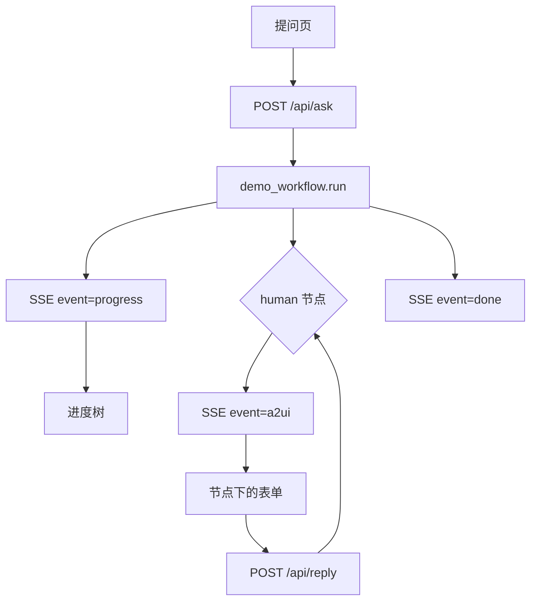

# 调研报告进度树：工作流跑到一半要问人，进度和表单分两条流

本文记录现有 `learn_note/example/swarmflow_a2ui`。前端提交一个问题，后端用预编写的 SwarmFlow 脚本跑调研流程。SSE 上进度树和 A2UI 表单分两种事件。Agent 节点由同进程确定性后端回答，不需要模型 API Key。human 节点一直等到页面提交回复。

## 功能介绍

- `POST /api/ask` 为每次提问分配 `run_id`，后台跑 `backend/workflows/demo_workflow.py`。
- 脚本分三阶段：并行调研、人工审批、按风格撰写。驳回则停在审批，不再问风格。
- 进度事件折成一棵树：工作流为根，阶段挂在根下，agent、human 和日志挂在当前阶段下。
- human 开始时另发一条 `a2ui` 事件，表单画在对应节点下面。节点结束后发 `deleteSurface`，表单撤掉。
- 同一条事件日志带递增 id。SSE 断线后用 `Last-Event-ID` 补发，不重跑脚本。
- 一次运行同时只等一个 human。回复送到错误的 `run_id`，或当前没有等待，请求失败，脚本继续停在原节点。

## 使用场景

页面输入一个问题，例如「进度树和人工审批怎么分开」。随后应看到：

1. 阶段「调研」下并行出现「架构调研」「能力调研」，完成后带 token。
2. 阶段「审批」下「审批调研」变为等待输入，节点内出现通过 / 驳回。驳回理由可空。
3. 点驳回后流程结束。结果是 `{"status":"rejected","reason":"..."}`。没有风格选择，也没有报告。
4. 重新提问并点通过。接着出现「选择风格」（简报 / 详细报告，默认简报）和「补充关注点」。
5. 提交后「撰写报告」完成。结果含 `title` 与 `body`。风格为详细报告时正文能看出「详细报告」；填了关注点时正文带上这段文字。

进度树和表单来自不同 SSE 事件。表单只在节点状态为 `waiting_for_human` 时渲染。

## 不在本 demo

- 真实模型。三个 agent 的结构化结果按 label 写死。
- `agent_session`、`fork`、`verify`。脚本只用 `phase`、`log`、`parallel`、`agent`、`human`、`budget`。
- 一次运行里同时挂多个表单。`HumanManager` 按 `run_id` 只保留一轮等待。
- 多页面协作。进程内字典保存 bridge、任务和等待，重启后 `run_id` 失效。
- 把 human 回复写进进度节点的 detail。detail 在开始时是去掉标记后的提示词，完成时换成引擎的 outcome。

## 架构



```text
learn_note/example/swarmflow_a2ui/
  backend/main.py
  backend/swarmflow_runner.py    # 离线 backend、进度投影、跑脚本
  backend/a2ui_bridge.py         # 提示词标记转 A2UI
  backend/human_manager.py
  backend/event_bridge.py
  backend/workflows/demo_workflow.py
  frontend/                      # React + A2UI v0.9 + zustand
```

`run_workflow` 把脚本里的 `swarmflow` 名字映射到引擎门面。进度回调是同步的：先 `HumanManager.begin`，再发布 progress，再发布 a2ui。这样即使用户回复发生在 `send_turn` 之前，Future 里也已经有结果。

## 脚本

`META.name` 为 `research-report`。阶段依次是「调研」「审批」「撰写」。`workflow_token_limit` 为 2000。`run(args)` 的 `args` 是用户问题字符串。

1. `phase("调研")`，日志「开始调研：{问题}」。`parallel` 两个 agent：`架构调研`（schema 要 `summary`、`points`）、`能力调研`（同样 schema）。
2. `phase("审批")`。human「审批调研」，提示词首行 `[approval]`，schema 要 `action`、`reason`。`action` 不是 `approve` 时写驳回日志并返回 `{status, reason}`。
3. `phase("撰写")`。human「选择风格」，首行 `[choice:brief=简报|detailed=详细报告]`，schema 只要 `style`。接着 human「补充关注点」，首行 `[text]`，schema 只要 `focus`。
4. 日志打印 `budget.remaining()`。agent「撰写报告」返回 `{title, body}`。再记一条「报告已生成」，把该对象作为运行结果。

离线 agent 按 label 计 token，并同时记入会话账本和 workflow 账本：

| label | tokens | 结果要点 |
| --- | --- | --- |
| 架构调研 | 320 | summary 提到 SwarmFlow；points 含 phase、parallel、human |
| 能力调研 | 280 | summary 提到进度树和 A2UI；points 含 SSE、三种表单、预算 |
| 撰写报告 | 640 | title 含主题；body 含选定风格。有关注点时再拼进 body |
| 其他 label | 100 | 同样按 label 分支，未知名走撰写报告的拼装 |
| human 一轮 | 16 | 不调用模型 |

主题从提示词里「主题：」之后、第一个句号或换行之前截取。

human 回复按 schema 的 `required` 收成对象：

| required | 结果 |
| --- | --- |
| 含 `action` | `{action, reason}`。`action` 用按钮名，`reason` 来自 context |
| 含 `style` | `{style}`。ChoicePicker 的值是数组，取第一项；空则 `brief` |
| 含 `focus` | `{focus}`。空字符串也合法 |
| 无 schema | 纯文本 |

## 进度树

`_Projector` 只转发这些引擎事件，其余丢弃。

| 引擎事件 | 节点 |
| --- | --- |
| `WORKFLOW_STARTED` | id `workflow`，类型 `workflow`，状态 `running`，无父节点 |
| `PHASE` | id `phase:{标题}`，父节点为 workflow。上一阶段先标 `completed` |
| `AGENT_STARTED` | 父节点为当前阶段。`human` / `human_session` 的类型是 `human`，状态 `waiting_for_human`，detail 为去掉首行标记的提示词。其余类型是 `agent`，状态 `running` |
| `AGENT_COMPLETED` | 同一节点改为 `completed`，带上 `tokens` |
| `AGENT_FAILED` | 类型按 `agent`，状态 `failed` |
| `LOG` | 新节点 `log:{序号}`，状态 `completed`，挂在当前阶段下 |
| `WORKFLOW_COMPLETED` | 当前阶段和根节点改为 `completed` |
| `WORKFLOW_FAILED` | 根节点改为 `failed` |

节点 id 用引擎的 `agent_id`，没有则用 label。前端按 `parentId` 组树。同一 `eventId` 只应用一次。human 的 A2UI `surfaceId` 由节点 id 收成 `surface-{可见字符}`，非字母数字变成单个连字符。

页面状态文案：进行中、已完成、等待输入、失败。有 token 时显示 `{n} tokens`。

## A2UI 标记

标记只看提示词首行。catalog 为 A2UI basic v0.9。正文是标记之后的文字。

| 首行 | 控件 | 按钮动作 |
| --- | --- | --- |
| `[approval]` | 说明、可选长文本「驳回理由」、通过 / 驳回 | `approve` 或 `reject`，context 带 `reason` |
| `[choice:值=标签\|值=标签]` | 互斥 ChoicePicker，默认选第一项 | `submit`，context 带 `style` |
| `[text]`，或无法识别的标记 | 长文本，标签用 human 的 label | `submit`，context 带 `focus` |

前端把按钮的 `name` 当作 `action`，把 `context` 原样交给 `POST /api/reply`。

## HTTP

监听 `127.0.0.1:8000`。CORS 允许任意来源。进程内按 `run_id` 保存 `EventBridge` 和任务。

| 方法 | 路径 | 行为 |
| --- | --- | --- |
| GET | `/api/health` | `{"status":"ok"}` |
| POST | `/api/ask` | 体为 `question`。返回 `{"run_id": "<uuid>"}`，并启动脚本 |
| GET | `/api/events/{run_id}` | SSE。未知 `run_id` 为 404 |
| POST | `/api/reply` | 体为 `run_id`、`action`、`context`。成功 `{"ok": true}`。未知 run 为 404。没有等待中的 human 为 409，detail 为「当前没有等待中的 human 节点」 |

SSE 事件名是 `progress`、`a2ui`、`done`，`id` 从 1 递增。`data` 为 JSON。

- `progress`：`type`、`nodeId`、`nodeType`、`label`、`status`、`parentId`、`tokens`，有内容时再加 `detail`。
- `a2ui`：`type`、`surfaceId`、`nodeId`、`messages`。
- `done`：成功 `{ok: true, result}`；失败 `{ok: false, error}`。生成器遇到 `done` 后结束。

`Last-Event-ID` 缺省或非整数时按 0。先推 id 更大的历史，再推新事件。客户端断开则退订。脚本异常时再补一条根节点 `failed` 的 progress，然后 `done`。`finally` 里取消尚未完成的 human 等待。

## 前端

端口 `5173`，把 `/api` 代理到 `8000`。标题为「SwarmFlow 交互 Demo」。

- 提交问题后先把 `runId` 设为 `pending`，等 `/api/ask` 返回再换成真实 id 并订阅 SSE。
- 运行中不能再次提交。
- 树为空时显示「提交问题后，这里会显示阶段、Agent 和人工节点。」
- `done.ok` 为真时，底部「运行结果」展示格式化后的 JSON。失败时显示 `error`。

两个示例的前端都占用 `5173`，不能同时开。

## 运行

```bash
cd learn_note/example
source .venv/bin/activate
cd swarmflow_a2ui
python -m uvicorn backend.main:app --host 127.0.0.1 --port 8000
```

另开终端：

```bash
cd learn_note/example
npm run dev:swarmflow
```

浏览器打开 http://127.0.0.1:5173 。不需要填写 `.env`。

## 验收

1. 提交任意非空问题后，进度树先有「调研」，其下两个 agent 变为已完成，并分别显示 320 与 280 tokens。
2. 「审批调研」变为等待输入，表单有「通过」「驳回」。此时 `POST /api/reply` 以外的空等不会自行继续。
3. 驳回后底部结果的 `status` 为 `rejected`，树里没有「选择风格」。
4. 再次提问并依次通过、选择「详细报告」、填写关注点。结果 `body` 同时含「详细报告」和这段关注点。撰写节点显示 640 tokens。
5. 刷新页面后旧 `run_id` 不再在内存中，原 SSE 返回 404。新提问使用新的 `run_id`。
