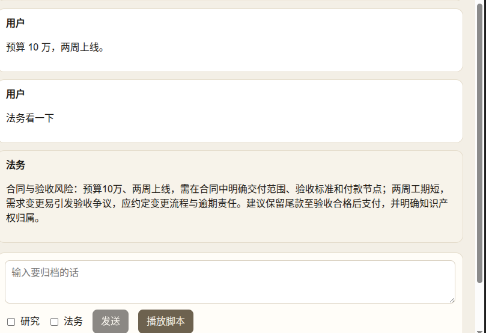

# 专家协作空间：用 SwarmChat 群聊做一间会点名唤醒的公开聊天室

> 建议标题：`openJiuwen | SwarmChat | 专家协作空间：公开归档、按需唤醒、专家当众回复`
>
> 本文记录我在 openJiuwen agent-core 里做的一个小 Demo：`swarmchat_room`。页面是一间公开聊天室：人说的话全部进历史；只有勾选的专家会被叫醒，根据群聊摘录用真实模型当众回复。重点不是「预算 10 万两周上线」这个玩具场景，而是三件事：**公开消息怎么归档**，**点名如何决定谁开口**，以及**后开口的专家如何看见先开口专家的公开回复**。

## 目录

1. [一、先说问题：多人专家协作难在哪](#一先说问题多人专家协作难在哪)
2. [二、整体架构](#二整体架构)
3. [三、SwarmChat 在建模什么](#三swarmchat-在建模什么)
4. [四、建房：一间进程内的房间](#四建房一间进程内的房间)
5. [五、账本、真相源与消息表结构](#五账本真相源与消息表结构)
   - [消息表长什么样](#消息表长什么样)
6. [六、归档与唤醒：同一条入口，两道闸门](#六归档与唤醒同一条入口两道闸门)
7. [七、摘录、模型、公开发言](#七摘录模型公开发言)
8. [八、前端只要把三件事画清楚](#八前端只要把三件事画清楚)
9. [九、这个 Demo 故意没做什么](#九这个-demo-故意没做什么)
10. [十、分布式时怎么处理 history.jsonl](#十分布式时怎么处理-historyjsonl)
11. [十一、怎么跑](#十一怎么跑)
12. [十二、总结](#十二总结)

---

## 一、先说问题：多人专家协作难在哪

做过「一群专家围着一个需求讨论」的同学，大概都撞过这几堵墙：

- 约束要先说完。预算、工期、范围往往是人先摆到桌上，这时还不该叫醒任何模型；
- 需要研究意见时，只该叫醒研究；需要法务意见时，只该叫醒法务；
- 法务开口时，必须看得到研究已经说过的公开结论，否则两个人各说各话；
- 研究不该因为法务发了一句公开回复，就被再次叫醒。

如果把整段群史塞进每个专家的上下文，成本和噪声都会涨。如果专家回复再去 @ 别人，房间里会出现互相叫醒的连环炮。

openJiuwen 的 SwarmChat 给的解法很克制：**公开房间里每句话都归档；唤醒是另一条闸门，只看 `mentions`。** 本 Demo 不拉起完整的 `TeamAgent`，只走到群聊这一层：`TeamBackend` 负责归档和发言身份，摘录交给模型，回复再写回同一间房。

---

## 二、整体架构

传输很简单：一条 HTTP 归档，页面再拉历史。没有 SSE，也没有 A2UI。

```
浏览器 (React)
   │  GET  /api/roster      勾选框名册
   │  GET  /api/history     history.jsonl 解析结果
   │  POST /api/messages    {body, mentions, client_message_id}
   ▼
FastAPI
   └─ Room
         ├─ TeamBackend.append_group_message   用户发言归档
         ├─ context_for                        给被点名专家做摘录
         ├─ SharedModel                        根目录 .env 里的真实模型
         └─ GroupSendMessageTool               专家公开回复（mentions=[]）
                │
                ▼
         workspace/room.db 广播行 + workspace/.../history.jsonl
```

项目结构：

```
swarmchat_room/
  backend/
    main.py                 # /api/health、/roster、/history、/messages
    room.py                 # 建房、归档、摘录、模型回复、专家发言
  frontend/
    src/App.tsx             # 消息列表、勾选、播放脚本、摘录旁注
  workspace/                # 群聊历史投影目录（gitignore）
  doc/                      # 本文
```

一次点击在界面上是这样的：

1. 输入「预算 10 万，两周上线。」，两个专家都不勾选。消息进历史，没有专家气泡，旁边也没有摘录；
2. 勾选研究，发送「请评估技术可行性」。研究拿到摘录，用模型公开回复；
3. 只勾选法务，发送「请看法务风险」。法务摘录里能看到研究那句公开回复；研究保持沉默；
4. 点名不存在的人，接口返回 400，历史不增加；
5. 用同一个 `client_message_id` 重发同一句话，返回 `duplicate=true`，研究不会再出现第二条回复。

---

## 三、SwarmChat 在建模什么

读源码时，最值得抓住的是这四个概念：

| 概念 | 含义 |
| --- | --- |
| 公开广播 | 消息进团队会话的广播表，并投影到 `history.jsonl` |
| `mentions` | 显式成员名列表。为空只归档；非空才生成 `notified_members` |
| `context_for` | 按该成员广播水位到触发消息，取最近几条摘录，并附上历史文件路径 |
| `GroupSendMessageTool` | 作者绑定当前 `backend.member_name`，不接受调用方伪造 `sender` |

整条链路可以记成一句话：

**用户发言 → 归档并投影 → 按 mentions 叫醒 → 摘录进模型 → 专家公开回复（不再点名他人）**

注意：本 Demo 故意不跑完整的 `GroupMessageHandler`，因此不推进 `read_at`。两位专家第一次被 @ 时水位都是 0，摘录窗口是 `(0, 触发时间]` 内最新几条，并带上本次触发消息。正因为不推进水位，法务第二次开口前仍能从 0 扫到研究已经公开的那句回复；又因为法务那条消息的 `mentions` 只有 `legal`，研究不会再次开口。

---

## 四、建房：一间进程内的房间

进程启动时只建一次房。数据库用持久化 SQLite 文件，事件总线用 `InProcessMessager()`，没有订阅消费者；广播发布失败只记日志，不回滚已写入的消息。

名册很短：主持人 `leader`，研究 `research`，法务 `legal`。页面勾选框只暴露后两位。`TeamBackend` 默认身份是主持人。账本和历史都落在 demo 目录：

```python
WORKSPACE_DIR = Path(__file__).resolve().parents[1] / "workspace"
DB_PATH = WORKSPACE_DIR / "room.db"

self.db = TeamDatabase(DatabaseConfig(
    db_type="sqlite",
    connection_string=str(DB_PATH),
))
self.backend = TeamBackend("room", "leader", True, self.db, self.messager)

self.backend.group_chat_spec = TeamAgentSpec(
    agents={"leader": DeepAgentSpec()},
    team_name="room",
    leader=LeaderSpec(member_name="leader"),
    workspace=TeamWorkspaceConfig(
        enabled=True,
        root_path=str(WORKSPACE_DIR),
        version_control=False,
    ),
)
self.backend.bind_group_session("discussion-1")
```

重启后端时，`create_team` / `create_member` 遇到已有行会跳过，广播表和 `history.jsonl` 都还在，可以接着聊。页底显示的 `context_path`，就是这份 `history.jsonl` 的绝对路径。

---

## 五、账本、真相源与消息表结构

读 SwarmChat 时最容易混的是：数据库和 `history.jsonl` 到底谁说了算。可以记成一句话：

**先信数据库，再投影成文件；页面看文件，规则看数据库。**

| | `workspace/room.db`（账本） | `history.jsonl`（公告栏） |
| --- | --- | --- |
| 角色 | 内部真相源 | 对外投影 |
| 负责什么 | 名册校验、落库、duplicate、算摘录窗口 | 给人看、给摘录文案附路径 |
| 页面气泡从哪来 | 不直接读 | `GET /api/history` 读这个文件 |
| 进程重启后 | 文件还在，可续聊 | 文件还在；也可按账本重投影 |

本 Demo 里数据库是文件 SQLite：`swarmchat_room/workspace/room.db`。它至少干四件事：

1. **名册**。启动时写入团队 `room`，以及主持人、研究、法务。点名未知成员时，`post_message` 查成员表，查不到就整次失败、不落库。
2. **公开消息真相源**。用户和专家的发言先写成广播行，带上 `client_message_id`、`mentions` 等 meta。重复发送靠这里判 `duplicate`。
3. **摘录范围**。`context_for` 从库里读广播消息和时间戳，再按该成员的 `read_at`（本 Demo 不推进，基本是 0）截出最近几条。源码注释也写了：范围由 DB 定，不是直接读历史文件。
4. **投影原料**。写完库之后调用 `sync_history`，把广播行同步成 `workspace/.../history.jsonl`。

用会议室类比：名册是门禁；广播表是会议记录本；`read_at` 是每人看到哪一页；`history.jsonl` 是贴在门口给人扫一眼的公告。公告坏了可以按账本重印，规则仍以账本为准。

这套分工在单体里很顺；一旦多机、多成员进程，**不能把 `history.jsonl` 当成跨机真相源**。分布式怎么演进见[第十节](#十分布式时怎么处理-historyjsonl)。

### 消息表长什么样

`db.message` 不是一张全局固定叫 `message` 的表，而是**按会话动态建表**。会话绑在 `discussion-1` 时，表名是：

```text
team_message_<blake2s(session_id) 的 16 位 hex>
```

字段来自 `TeamMessageBase`：

| 列 | 类型 | 说明 |
| --- | --- | --- |
| `message_id` | `str` PK | 消息主键。群聊里由 `team + session + client_message_id` 算 uuid5 |
| `team_name` | `str` | 团队名，外键到 `team_info`，本 Demo 为 `room` |
| `from_member_name` | `str` | 发送者。用户是 `user`，专家是 `research` / `legal` |
| `to_member_name` | `str?` | 私信收件人。群聊广播为 `NULL` |
| `content` | `str` | 正文。群聊用 `inline_content=True`，直接存文本 |
| `timestamp` | `bigint` | 毫秒时间戳，摘录窗口靠它裁剪 |
| `broadcast` | `bool` | 是否广播。群聊为 `true` |
| `protocol` | `str` | 默认 `plain` |
| `is_read` | `bool?` | 仅私信用。广播固定 `NULL` |
| `meta` | `str?` | JSON 字符串，群聊元数据放这里 |

每张会话消息表还有两组复合索引：`(to_member_name, is_read, timestamp)` 和 `(broadcast, timestamp)`。

群聊写入时，`meta` 大致是：

```json
{
  "type": "group_chat",
  "client_message_id": "script-2",
  "sender_name": "user",
  "mentions": ["research"],
  "attachments": []
}
```

`client_message_id` 是这次发送的身份证。`post_message` 用 `team + session + client_message_id` 算出 `message_id`；主键已存在且正文、mentions 相同，就返回 `duplicate=true`，Demo 不再叫模型。

广播已读水位不在消息表里，而在同会话的：

```text
message_read_status_<同样的 hex>
```

列是 `(member_name, team_name)` 主键 + `read_at`。本 Demo 不推进它，所以 `context_for` 里读到的基本是 `0`，摘录窗口是 `(0, 触发时间]`。

串起来看一次「勾选研究并发送」：

```text
前端 mentions=["research"], client_message_id="xxx"
        │
        ▼
append_group_message("user", ...)
        ├─ 查名册 research
        ├─ 写 team_message_* 广播行 + meta
        └─ sync_history → history.jsonl
        │
        ▼
context_for(research, trigger)   # 按 read_at 从库截最近几条
        │
        ▼
模型生成回复 → GroupSendMessageTool
        ├─ 再写一条广播（from=research）
        └─ 再 sync_history
        │
        ▼
前端 GET /api/history 读文件，画出气泡
```

---

## 六、归档与唤醒：同一条入口，两道闸门

用户发送走 `POST /api/messages`。整段处理包在 `set_session_id("discussion-1")` 里。`post_message` 内部还会再 set/reset 一次，外层令牌负责在退出后把会话恢复回来，这样后面的 `get_message` 和 `context_for` 仍打在同一张动态表上。

第一步永远是归档：

```python
result = await self.backend.append_group_message(
    "user",
    body,
    client_message_id=client_message_id,
    mentions=mentions,
    attachments=(),
)
```

这里有两道闸门：

1. **成员校验**。`mentions` 里出现未知名字，`post_message` 抛 `ValueError`，整次请求不落库，接口返回 `invalid_group_chat`；
2. **幂等**。相同 `client_message_id` 配上相同正文和 mentions，返回 `duplicate=true`，Demo 直接结束，不再叫模型、不再二次回复。

`mentions` 为空时，`notified_members` 为空。消息进了历史，房间里没有人被叫醒。这就是「先把约束说完」那一步。

---

## 七、摘录、模型、公开发言

被点名的专家不会拿到整份 `history.jsonl` 文本，而是拿到 `context_for` 渲染好的一段中文通知：时间范围、触发消息 id、历史文件路径，以及最近几条 JSON 摘录。Demo 把这段摘录直接喂给模型：

```python
trigger = await self.backend.db.message.get_message(result.message.message_id)
excerpt = await context_for(self.backend, member_name, trigger)
content = await self._reply_text(member_name, excerpt)
```

`context_for` 要读数据库行上的 `meta`，所以这里必须传消息表行，不能传已经投影过的 `ConversationMessage`。

模型配置复用示例根目录的 `common.SharedModel`，从 `.env` 读 `API_BASE`、`API_KEY`、`MODEL_NAME`、`MODEL_PROVIDER`。研究和法务各有一句系统提示，约束角色和篇幅；用户消息就是摘录原文。

发言时临时切换身份。`GroupSendMessageTool` 不接受调用方指定 `sender`，作者就是当时的 `backend.member_name`：

```python
self.backend.member_name = member_name
try:
    output = await GroupSendMessageTool(self.backend, make_translator("cn")).invoke({
        "content": content,
        "client_message_id": f"reply-{client_message_id}-{member_name}",
    })
finally:
    self.backend.member_name = "leader"
```

专家回复的 `mentions` 固定为空。这句话会进公开历史，供后来的人看见，但不会把刚发过言的专家再叫醒。一次请求勾选多人时，按 `notified_members` 顺序逐个摘录、逐个回复。

---

## 八、前端只要把三件事画清楚

前端是精简 React，端口 `5175`，`/api` 代理到 `8002`。进入页面先拉名册和历史。

页面上刻意突出三件事：

1. **只归档**：不勾选专家时，只有用户气泡；
2. **点名唤醒**：勾选谁，谁出现模型回复；用户消息旁边贴上本次 `excerpts`；
3. **后到的人看得见**：法务那次摘录里含有研究的公开回复；研究没有第二条气泡。

实际跑起来大致是这样：先把预算和工期归档，再勾选法务点名唤醒，法务当众给出合同与验收风险建议。底部是输入框、专家勾选，以及「发送 / 播放脚本」。



「播放脚本」和手工输入走同一个接口。脚本用固定的 `client_message_id`，用来演示未知成员失败和重复发送。摘录面板挂在当次响应上，刷新后历史气泡还在，摘录旁注会消失——它是调试视图，不是第二份持久存储。真正的持久投影是页底那条 `history.jsonl`。

---

## 九、这个 Demo 故意没做什么

它能把 SwarmChat 的主路径跑通，但有几处边界写在这里，避免把示例当成完整团队运行时。

**1. 没有拉起 TeamAgent**

没有 Leader 模型调度，没有任务看板，没有成员进程拉起。`TeamBackend` 只充当群聊记账员和发言身份。

**2. 没有推进 read_at**

同一专家被第二次 @ 时，摘录仍从 0 取最近几条。接上真实 `GroupMessageHandler` 之后，水位会前移，窗口语义会变。

**3. 专家不会互相叫醒**

Demo 在工具调用时把 `mentions` 留空。如果把别的专家写进回复的 mentions，公开房间会重新进入唤醒逻辑。

**4. 仍是单进程房间**

账本已落到 `workspace/room.db`，重启可续聊。但事件总线仍是 `InProcessMessager()`，没有多成员进程、也没有跨机共享。清空演示数据时，删掉 `swarmchat_room/workspace/` 即可。若要把「文件投影」拆到多机，见下一节。

---

## 十、分布式时怎么处理 history.jsonl

`history.jsonl` 在 SwarmChat 里本来就不是分布式共识层，而是**本地可读投影**：写完广播行之后 `sync_history` 在成员 workspace 上原子重写一份，方便 Agent `read_file`、也方便本 Demo 的 `GET /api/history`。文件丢了可以从 DB 重建——官方群聊规格里也是这个分工。

单体感主要来自：写投影的进程和读文件的 Agent **共享同一份本地盘**。多机时原则不变：

**跨机只共享账本（数据库）和唤醒总线；不拿某台机器上的 jsonl 路径当主键。**

| 层级 | 本 Demo（单体） | 分布式建议 |
| --- | --- | --- |
| 真相源 | 文件 SQLite `room.db` | PostgreSQL / MySQL 等共享库 |
| 唤醒 | `InProcessMessager()` | Redis / NATS / Kafka 等；消费者按 `mentions` 拉起 |
| 摘录 | `context_for` 读本机库 | 仍读共享库，窗口语义不用改 |
| `history.jsonl` | 本机 workspace 投影 | 降级为可选本地缓存，或换成查询 API / 对象存储 |

常见三条演进路径：

1. **投影仍本地（最贴现有设计）**  
   每个成员进程在自己的 workspace 里维护一份 jsonl；收到广播或写完库后再从共享 DB `sync_history`。Agent 继续 `read_file` 本地路径，但**绝不**把绝对路径当成跨机主键。

2. **去掉文件依赖（服务化）**  
   前端/网关直接分页查广播表（或继续走 `GET /api/history`，只是后端改读库）。模型需要全文时用查库工具，而不是读 `/home/.../history.jsonl`。本 Demo 的页面其实已经偏这种：气泡来自 HTTP，不是浏览器直接打开文件。

3. **共享对象存储**  
   投影写到 S3 / OSS（按 team + session 一份），提示词里给 object key。适合「多机都要读同一份全文」；权威记录仍是 DB。

落地时再盯三件事：

- **谁写投影**：现有实现是锁内全量重写。多 API 副本同时往同一块共享盘 `sync_history` 容易打架——更稳的是「每节点本地投影」或「单独一个投影服务」。
- **路径不能出网**：摘录模板里的 `context_path` 只对本机有意义；分布式提示应给 session id +「用工具拉历史」。
- **读延迟以库为准**：投影异步刷盘时，`context_for` 仍从 DB 截窗口；不要用「jsonl 是否刷完」当唤醒条件。

一句话：**分布式把账本和总线做共享；`history.jsonl` 继续当本机或对象存储上的只读投影，能重建、不当主库。**

---

## 十一、怎么跑

依赖装在示例根目录 `learn_note/example`：共用 `.venv`、`node_modules` 和 `.env`。

```bash
cd learn_note/example
cp .env.example .env   # 填写 API_KEY 等
source .venv/bin/activate
```

仓库根目录启动后端：

```bash
uv run uvicorn --app-dir learn_note/example/swarmchat_room backend.main:app --host 127.0.0.1 --port 8002
```

另开终端：

```bash
cd learn_note/example
npm run dev:swarmchat
```

浏览器打开 http://127.0.0.1:5175 。点「播放脚本」，或自己勾选专家发送。

---

## 十二、总结

这条链路可以收成六句话：

- **数据库是账本**：名册、落库、duplicate、摘录窗口都以它为准；
- **文件是公告栏**：`history.jsonl` 给页面看，也给摘录附路径；分布式里它仍是投影，不当跨机真相源；
- **mentions 管唤醒**：不勾选只归档，勾选谁谁开口；
- **摘录管上下文**：专家先看最近几条，再决定怎么当众说；
- **绑定身份管发言**：工具作者是当时的成员名，专家回复不再点名他人；
- **多机先共享库和总线**：本地或对象存储上的 jsonl 能重建即可。

多人专家协作里，难的不是「再加一个模型」，而是把「全员可见」和「按需开口」拆开。SwarmChat 把这两件事做成同一间房里的两道闸门之后，后面的专家可以站在前面的公开结论上继续说话，又不会把整个房间重新吵起来。

---

**参考**

- 群聊归档与摘录：`openjiuwen/agent_teams/group_chat/handler.py`
- 专家公开发言工具：`openjiuwen/agent_teams/group_chat/tools.py`
- 历史文件投影：`openjiuwen/agent_teams/group_chat/conversation.py`
- 消息表模型：`openjiuwen/agent_teams/tools/models.py`（`TeamMessageBase`）
- 本文项目代码：[https://github.com/songhaowei666/learn_openjiuwen/tree/main/swarmchat_room](https://github.com/songhaowei666/learn_openjiuwen/tree/main/swarmchat_room)

*示例基于 openJiuwen agent-core，遵循 Apache-2.0 协议。*
